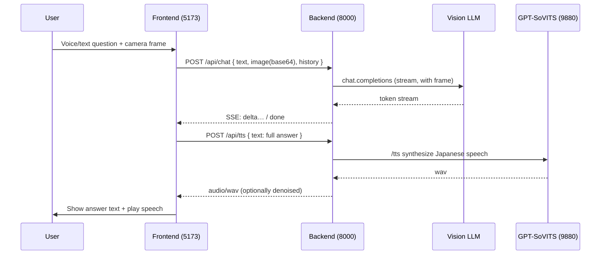

# AI Visual Conversation Assistant

[简体中文](README.md) · **English**

> Point your camera at something, ask a question, and the AI looks at the frame, answers in Japanese, and reads it aloud in a cloned voice.

A local demo "vision + voice" conversation app: point the camera at a target, ask by voice or text, and the backend hands the current frame together with your question to a vision-capable LLM that answers as a stream. The reply is then synthesized into Japanese speech via [GPT-SoVITS](https://github.com/RVC-Boss/GPT-SoVITS). The frontend opens with a cinematic WebGL intro, then lands on a two-pane "camera + chat" workspace.

---

## Features

- **Visual Q&A**: every question captures the current camera frame (base64 JPEG) and sends it along, so the model answers based on what it sees.
- **Voice input**: "push-to-talk" real-time transcription via the browser Web Speech API; typing text directly is also supported.
- **Streaming answers**: the backend pushes model output token-by-token over SSE.
- **Japanese voice playback**: replies are synthesized into a cloned-voice Japanese speech via GPT-SoVITS, using **wait-then-play** — the full audio is prepared first, then the text appears and the audio plays at the same time, avoiding "subtitles before sound".
- **Audio post-processing**: optional noise gate + high-pass/low-pass filtering to reduce synthesized-speech noise floor.
- **Cinematic intro**: a 5-page full-screen page-flip intro built with Three.js / React Three Fiber, with a two-stage "lift" transition on the last page into the workspace.
- **Graceful degradation**: falls back to a 2D animated background when WebGL is unavailable or "reduce motion" is on; gives clear messages (in Chinese) and keeps usable features when camera / speech recognition / speech playback is unsupported.
- **Validate on startup**: the backend fail-fast validates required environment variables at startup; missing ones cause an immediate exit with the names printed.

## Tech Stack

| Layer | Technology |
| --- | --- |
| Frontend | React 18 · TypeScript · Vite 6 · Three.js + @react-three/fiber/drei/postprocessing · Zustand · CSS Modules |
| Backend | Python · FastAPI · Uvicorn · pydantic-settings · sse-starlette · OpenAI SDK (OpenAI-compatible API) · httpx |
| Models | Any OpenAI-compatible vision LLM (chat completions + `image_url`) · GPT-SoVITS api_v2 (speech synthesis) |
| Testing / Quality | Frontend Vitest + Testing Library · ESLint; backend pytest · ruff |

## Workflow



Key points:
1. The frontend captures the current camera frame and trims history (at most 6 text-only rounds).
2. `POST /api/chat` carries `text` / `image` / `history`; the backend injects a Japanese system prompt, passes the image as `data:image/jpeg;base64,...` to the model, and returns the answer as an SSE stream.
3. After collecting the full answer, the frontend calls `POST /api/tts`; the backend forwards to GPT-SoVITS to synthesize a wav with optional denoising.
4. Once the audio is ready, the frontend shows the text **and** plays the audio at the same time — that's wait-then-play.

> Note: the model is constrained by the system prompt to **always answer in Japanese** (even if the question is in Chinese).

## Directory Structure

```
.
├── frontend/                # React + Vite frontend
│   └── src/
│       ├── cinematic/       # WebGL cinematic intro (Scene/HeroFigure/FluidParticles/paged scroll…)
│       ├── components/      # Workspace UI (camera preview, talk button, answer, history…)
│       ├── effects/         # 2D fallback background LiveBackdrop
│       ├── hooks/           # useCamera / useSpeechRecognition / useChatStream / useVoicePlayback
│       ├── lib/             # chatStream(SSE) / ttsClient / sentences / constants
│       ├── store/           # Zustand: intro stage state
│       └── App.tsx          # App shell wiring the above together
├── backend/                 # FastAPI backend
│   ├── app/
│   │   ├── main.py          # App assembly, CORS, lifespan, config validation
│   │   ├── config.py        # Env vars → Settings (pydantic-settings)
│   │   ├── routes/          # /api/chat (SSE), /api/tts (wav)
│   │   ├── services/        # llm (vision streaming), tts, audio_filter, gpt_sovits_runtime
│   │   └── schemas.py       # Request/event data models
│   ├── tests/               # pytest
│   ├── requirements.txt
│   └── .env.example         # Config template (copy to .env)
└── .trellis/                # Trellis workflow (specs, tasks, dev journal)
```

## Requirements

- **Node.js** 18+ (20+ recommended) with npm
- **Python** 3.11+
- An **OpenAI-compatible vision model** endpoint (API Key + Base URL + model name)
- A working **GPT-SoVITS api_v2** service, with a Japanese reference audio and its transcript ready
- Latest **Chrome / Edge** recommended (camera, Web Speech API recognition); `localhost` or HTTPS is required locally to authorize camera and microphone

## Quick Start

### 1. Backend

```bash
cd backend
python -m venv .venv && source .venv/Scripts/activate   # Windows Git Bash; Linux/macOS use bin/activate
pip install -r requirements.txt

cp .env.example .env        # then edit .env, at least fill in the "required" items below
uvicorn app.main:app --reload --port 8000
```

After startup, visit <http://127.0.0.1:8000/docs> for the auto-generated API docs. If required environment variables are missing, the process exits immediately and prints the missing variable names.

### 2. GPT-SoVITS Speech Service

The backend's `/api/tts` forwards requests to GPT-SoVITS `api_v2`. Two ways to connect:

- **Start manually** (recommended): run GPT-SoVITS `api_v2.py` yourself, making sure it listens on `GPT_SOVITS_BASE_URL` (default `http://127.0.0.1:9880`).
- **Managed by the backend**: set `GPT_SOVITS_AUTO_START=true` and configure `GPT_SOVITS_ROOT_DIR` / `GPT_SOVITS_PYTHON_PATH` etc.; the backend will launch it during lifespan and stop it on exit.

### 3. Frontend

```bash
cd frontend
npm install
npm run dev
```

Open <http://127.0.0.1:5173>. The Vite dev server already proxies `/api` to `http://127.0.0.1:8000`, so no extra CORS config is needed.

## Configuration

Backend config comes from `backend/.env` (see `.env.example`). `.env` is gitignored — do not commit real secrets.

### Required (missing or empty causes startup failure)

| Variable | Description |
| --- | --- |
| `OPENAI_API_KEY` | API Key for the OpenAI-compatible endpoint |
| `OPENAI_BASE_URL` | Endpoint URL, e.g. `https://.../v1` |
| `OPENAI_MODEL` | A **vision-capable** model name |
| `GPT_SOVITS_REF_AUDIO_PATH` | Japanese reference audio path (must be accessible to the GPT-SoVITS process) |
| `GPT_SOVITS_PROMPT_TEXT` | Japanese transcript of the reference audio (must match the audio content) |

### Common optional items (excerpt; defaults in `.env.example`)

| Variable | Default | Description |
| --- | --- | --- |
| `MAX_HISTORY_ROUNDS` | `6` | Max history rounds carried |
| `MAX_IMAGE_BYTES` | `2000000` | Per-frame image limit (~2 MB); over the limit returns 413 |
| `REQUEST_TIMEOUT_SECONDS` | `60` | Timeout for model calls |
| `CORS_ALLOW_ORIGINS` | `http://localhost:5173` | Allowed frontend origins, comma-separated, **no wildcards** |
| `GPT_SOVITS_BASE_URL` | `http://127.0.0.1:9880` | GPT-SoVITS api_v2 URL |
| `GPT_SOVITS_TEXT_LANG` / `PROMPT_LANG` | `ja` | Synthesis language / reference audio language |
| `GPT_SOVITS_AUDIO_FILTER_ENABLED` | `true` | Whether to post-process synthesized audio for denoising |
| `GPT_SOVITS_AUTO_START` | `false` | Whether the backend manages the GPT-SoVITS process |

> Full variable list (noise gate threshold, high/low-pass frequencies, managed-process script/config/weight paths, etc.) is in `backend/.env.example` and `backend/app/config.py`.

## API Reference

All endpoints are prefixed with `/api` and accept `POST` only.

### `POST /api/chat` — Visual Q&A (SSE)

Request body:

```jsonc
{
  "text": "What is this?",              // required, non-empty
  "image": "<base64 JPEG>",            // optional; omit for text-only Q&A
  "history": [                          // optional, text-only history
    { "role": "user", "content": "…" },
    { "role": "assistant", "content": "…" }
  ]
}
```

Response is `text/event-stream`:

- Default event: `data: {"delta": "text fragment"}` — concatenate fragments for the full answer
- `event: done`: stream ended normally
- `event: error`: `data: {"message": "safe error message (in Chinese)"}`

### `POST /api/tts` — Speech Synthesis

Request body: `{ "text": "text to read aloud" }` (1–2000 characters).

Response: on success, `audio/wav` binary; on failure, `502` + `{ "message": "error message (in Chinese)" }`.

## Development & Testing

```bash
# Frontend
cd frontend
npm run lint          # ESLint
npm run test          # Vitest (jsdom)
npm run build         # tsc type-check + production build

# Backend
cd backend
ruff check .          # Lint
pytest                # Unit tests
```

## Notes

- The model must support mixed image+text input (OpenAI `image_url` format), otherwise visual Q&A won't work.
- The answer language is fixed to Japanese, controlled by the backend system prompt (see `backend/app/services/llm.py`).
- Camera and microphone require a secure context (`localhost`/HTTPS) to authorize; the browser asks for permission on first use.
- Voice playback depends on the external GPT-SoVITS service; if it's not running, the frontend shows "cannot connect to the speech synthesis service", but text answers still display normally.

## About Trellis

This repo's development workflow is managed by [Trellis](.trellis/workflow.md): spec docs in `.trellis/spec/`, tasks and research notes in `.trellis/tasks/`, and dev journal in `.trellis/workspace/`. See [`AGENTS.md`](AGENTS.md) for AI-collaboration notes.
