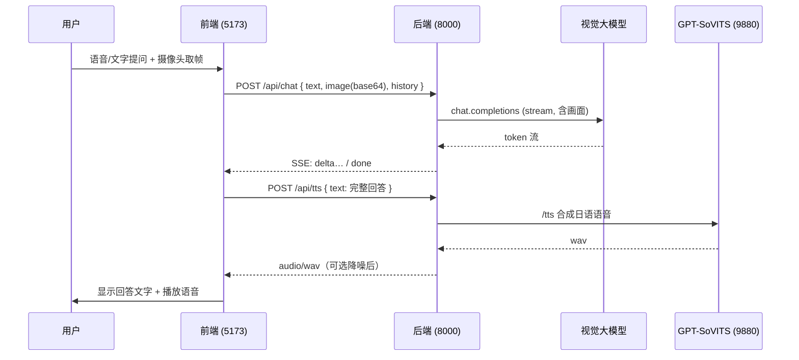

# AI 视觉对话助手

> 对着摄像头提问，AI 看着画面用日语回答，并以克隆音色朗读出来。

一个本地演示用的「视觉 + 语音」对话应用：用户把摄像头对准目标、用语音或文字提问，后端把当前画面连同问题交给具备视觉能力的大模型流式作答，再用 [GPT-SoVITS](https://github.com/RVC-Boss/GPT-SoVITS) 把回答合成为日语语音播报。前端带有一段 WebGL 电影化开场，进入后是「摄像头 + 对话」双栏工作台。

---

## 功能特性

- **视觉问答**：每次提问都会截取当前摄像头帧（base64 JPEG）一并发送，模型基于画面作答。
- **语音输入**：浏览器 Web Speech API「按住说话」实时转写，也支持直接输入文字。
- **流式回答**：后端通过 SSE 逐 token 推送模型输出。
- **日语语音播报**：回答经 GPT-SoVITS 合成为克隆音色的日语语音；采用 **wait-then-play**——整段语音准备就绪后再同时显示文字并播放，避免「字幕先于声音」。
- **音频后处理**：可选的噪声门 + 高通/低通滤波，降低合成语音底噪。
- **电影化开场**：基于 Three.js / React Three Fiber 的 5 页整屏翻页开场动画，末页两段式「掭起」过渡进入工作台。
- **优雅降级**：无 WebGL 或系统开启「减少动态效果」时回退到 2D 动态背景；不支持摄像头/语音识别/语音播报时给出明确中文提示并保留可用功能。
- **启动即校验**：后端启动时 fail-fast 校验必需环境变量，缺失会直接退出并打印需要补齐的变量名。

## 技术栈

| 层 | 技术 |
| --- | --- |
| 前端 | React 18 · TypeScript · Vite 6 · Three.js + @react-three/fiber/drei/postprocessing · Zustand · CSS Modules |
| 后端 | Python · FastAPI · Uvicorn · pydantic-settings · sse-starlette · OpenAI SDK（OpenAI 兼容接口）· httpx |
| 模型 | 任意 OpenAI 兼容的视觉大模型（chat completions + `image_url`）· GPT-SoVITS api_v2（语音合成）|
| 测试/质量 | 前端 Vitest + Testing Library · ESLint；后端 pytest · ruff |

## 工作流程



要点：
1. 前端截取摄像头当前帧并裁剪历史（最多 6 轮纯文本）。
2. `POST /api/chat` 携带 `text` / `image` / `history`，后端注入日语系统提示，把图片作为 `data:image/jpeg;base64,...` 传给模型，SSE 流式返回。
3. 前端收齐完整回答后调用 `POST /api/tts`，后端转发到 GPT-SoVITS 合成 wav 并做可选降噪。
4. 语音就绪后，前端**同时**显示文字并播放——这就是 wait-then-play。

> 说明：模型被系统提示约束为**始终用日语回答**（即便问题是中文）。

## 目录结构

```
.
├── frontend/                # React + Vite 前端
│   └── src/
│       ├── cinematic/       # WebGL 电影化开场（Scene/HeroFigure/FluidParticles/分页滚动…）
│       ├── components/      # 工作台 UI（摄像头预览、说话按钮、回答、历史…）
│       ├── effects/         # 2D 降级背景 LiveBackdrop
│       ├── hooks/           # useCamera / useSpeechRecognition / useChatStream / useVoicePlayback
│       ├── lib/             # chatStream(SSE) / ttsClient / sentences / constants
│       ├── store/           # Zustand：开场阶段状态
│       └── App.tsx          # 应用主壳，串联以上能力
├── backend/                 # FastAPI 后端
│   ├── app/
│   │   ├── main.py          # 应用装配、CORS、lifespan、配置校验
│   │   ├── config.py        # 环境变量 → Settings（pydantic-settings）
│   │   ├── routes/          # /api/chat（SSE）、/api/tts（wav）
│   │   ├── services/        # llm（视觉模型流式）、tts、audio_filter、gpt_sovits_runtime
│   │   └── schemas.py       # 请求/事件数据模型
│   ├── tests/               # pytest
│   ├── requirements.txt
│   └── .env.example         # 配置模板（复制为 .env）
└── .trellis/                # Trellis 工作流（规范、任务、开发日志）
```

## 环境要求

- **Node.js** 18+（建议 20+）与 npm
- **Python** 3.11+
- 一个 **OpenAI 兼容的视觉模型** 接口（API Key + Base URL + 模型名）
- 一个可用的 **GPT-SoVITS api_v2** 服务，且已准备好日语参考音频及其转写文本
- 浏览器建议使用最新版 **Chrome / Edge**（摄像头、Web Speech API 语音识别）；本地需 `localhost` 或 HTTPS 才能授权摄像头与麦克风

## 快速开始

### 1. 后端

```bash
cd backend
python -m venv .venv && source .venv/Scripts/activate   # Windows Git Bash；Linux/macOS 用 bin/activate
pip install -r requirements.txt

cp .env.example .env        # 然后编辑 .env，至少填好下面「必填项」
uvicorn app.main:app --reload --port 8000
```

启动后访问 <http://127.0.0.1:8000/docs> 查看自动生成的 API 文档。若必需环境变量缺失，进程会直接退出并打印缺失的变量名。

### 2. GPT-SoVITS 语音服务

后端的 `/api/tts` 会把请求转发给 GPT-SoVITS 的 `api_v2`。两种接入方式：

- **手动启动**（推荐）：自行运行 GPT-SoVITS 的 `api_v2.py`，确保监听 `GPT_SOVITS_BASE_URL`（默认 `http://127.0.0.1:9880`）。
- **由后端托管**：设置 `GPT_SOVITS_AUTO_START=true` 并配好 `GPT_SOVITS_ROOT_DIR` / `GPT_SOVITS_PYTHON_PATH` 等，后端会在 lifespan 中拉起并在退出时停止该进程。

### 3. 前端

```bash
cd frontend
npm install
npm run dev
```

打开 <http://127.0.0.1:5173>。Vite 开发服务器已把 `/api` 代理到 `http://127.0.0.1:8000`，无需额外跨域配置。

## 配置

后端配置来自 `backend/.env`（见 `.env.example`）。`.env` 已被 gitignore，请勿提交真实密钥。

### 必填项（缺失或为空将导致启动失败）

| 变量 | 说明 |
| --- | --- |
| `OPENAI_API_KEY` | OpenAI 兼容接口的 API Key |
| `OPENAI_BASE_URL` | 接口地址，如 `https://.../v1` |
| `OPENAI_MODEL` | **具备视觉能力**的模型名 |
| `GPT_SOVITS_REF_AUDIO_PATH` | 日语参考音频路径（需 GPT-SoVITS 进程可访问）|
| `GPT_SOVITS_PROMPT_TEXT` | 参考音频对应的日语转写文本（须与音频内容一致）|

### 常用可选项（节选，默认值见 `.env.example`）

| 变量 | 默认 | 说明 |
| --- | --- | --- |
| `MAX_HISTORY_ROUNDS` | `6` | 携带的最大历史轮数 |
| `MAX_IMAGE_BYTES` | `2000000` | 单帧图片上限（约 2 MB），超限返回 413 |
| `REQUEST_TIMEOUT_SECONDS` | `60` | 调用模型的超时时间 |
| `CORS_ALLOW_ORIGINS` | `http://localhost:5173` | 允许的前端来源，逗号分隔，**禁止通配符** |
| `GPT_SOVITS_BASE_URL` | `http://127.0.0.1:9880` | GPT-SoVITS api_v2 地址 |
| `GPT_SOVITS_TEXT_LANG` / `PROMPT_LANG` | `ja` | 合成语言 / 参考音频语言 |
| `GPT_SOVITS_AUDIO_FILTER_ENABLED` | `true` | 是否对合成音频做降噪后处理 |
| `GPT_SOVITS_AUTO_START` | `false` | 是否由后端托管 GPT-SoVITS 进程 |

> 完整变量列表（含噪声门阈值、高低通频率、托管进程的脚本/配置/权重路径等）见 `backend/.env.example` 与 `backend/app/config.py`。

## API 参考

所有接口前缀为 `/api`，仅允许 `POST`。

### `POST /api/chat` — 视觉问答（SSE）

请求体：

```jsonc
{
  "text": "这是什么？",                 // 必填，非空
  "image": "<base64 JPEG>",            // 可选；不传则纯文本问答
  "history": [                          // 可选，纯文本历史
    { "role": "user", "content": "…" },
    { "role": "assistant", "content": "…" }
  ]
}
```

响应为 `text/event-stream`：

- 默认事件：`data: {"delta": "片段文本"}`，逐段拼接即为完整回答
- `event: done`：流正常结束
- `event: error`：`data: {"message": "安全的中文错误信息"}`

### `POST /api/tts` — 语音合成

请求体：`{ "text": "要朗读的文本" }`（1–2000 字符）。

响应：成功为 `audio/wav` 二进制；失败返回 `502` + `{ "message": "中文错误信息" }`。

## 开发与测试

```bash
# 前端
cd frontend
npm run lint          # ESLint
npm run test          # Vitest（jsdom）
npm run build         # tsc 类型检查 + 生产构建

# 后端
cd backend
ruff check .          # Lint
pytest                # 单元测试
```

## 注意事项

- 模型必须支持图文混合输入（OpenAI `image_url` 格式），否则视觉问答无法工作。
- 回答语言固定为日语，由后端系统提示控制（见 `backend/app/services/llm.py`）。
- 摄像头与麦克风需在安全上下文（`localhost`/HTTPS）下授权；首次使用浏览器会请求权限。
- 语音播报依赖外部 GPT-SoVITS 服务，未启动时前端会提示「无法连接语音合成服务」，但文字回答仍可正常查看。

## 关于 Trellis

本仓库由 [Trellis](.trellis/workflow.md) 管理开发工作流：规范文档在 `.trellis/spec/`，任务与研究记录在 `.trellis/tasks/`，开发日志在 `.trellis/workspace/`。面向 AI 协作的说明见 [`AGENTS.md`](AGENTS.md)。
